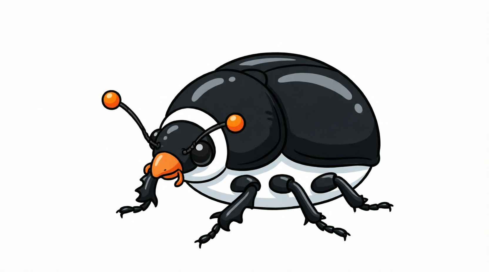

# 🐧🪲Mazak v0.0.2


> Величайшая языковая модель, которая превращает каждый символ вашего запроса в нелепое аллитерационное существо.
> 
> **Никаких миллиардов параметров. Только словарь, случай и абсурд.**

[](LICENSE)
[](https://python.org)
[](https://example.com)

## 🌟 Особенности

- 🧠 **Передовая архитектура** — проще некуда: `mazak_letters.get(char, " ")`  

- 🌐 **Мультиязычность** — детектит русский и английский через `isascii()` (бенчмарки не требуются)  

- 🎲 **Встроенные галлюцинации** — с вероятностью 1% вы получаете вкусную ошибку протокола  

- ⚡ **Молниеносная скорость** — никаких GPU, TPU, NPU, даже CPU почти не греется  

- 🔮 **Глубокий контекст** — каждый символ превращается в целую фразу, соединённую союзом `" и "`  

- 🐘 **Экологичность** — обучение не требуется, веса не загружаются, углеродный след = 0  

- Поддерживает и русский и английский

---

## 📦 Установка

```bash
git clone https://github.com/mxcoderr/mazak.git
cd mazak
```

## Запуск (в консоли)
```bash
pip3 install rich textual_image
pip install rich textual_image
python3 app.py 
```

Затем просто печатайте сообщения и наслаждайтесь ответами новой эры ИИ.

---

## 🧠 Как это работает (настоящий «внутренний механизм»)
Мы не используем трансформеры, внимание, эмбеддинги или backpropagation. Всё гениальное — просто:

1. Вы вводите текст 
2. Mazak переводит его в **ВЕРХНИЙ РЕГИСТР**.
3. Каждый символ ищется в словаре(успрощенно):

- "А" → "Арбузный Астроносорог Агрегатор" 
- " " → "Изгой опустошенный" (русский) или "Empty Tiger" (английский)
- и еще много замен изза которых этот readme может стать огромным

4. Фразы склеиваются через " и " (или " and ").
5. С вероятностью 1% вместо ответа выдаётся загадочная ошибка протокола.

--- 

## 🗂 Структура проекта

```text
mazak/
├── api.py        # главный класс Mazak, рулит языками
├── ru.py         # русский словарь существ
├── eng.py        # английский словарь существ
├── app.py        # TUI клиент для общения
└── README.md     # вы здесь
```
---


## 🎭 Философия 
Mazak — это **памятник хайпу вокруг LLM**.
Современные большие языковые модели — это, по сути, те же словари, 
но очень большие, обученные на терабайтах текста. 
Mazak делает это честно: его словарь написан вручную, без выжигания лесов и счётов за облачные GPU.

Каждый ответ Mazak столь же осмыслен (или бессмыслен), как и ответы «настоящих» LLM. Разница лишь в том, что мы не притворяемся.
> «Любой достаточно продвинутый словарь неотличим от LLM» — закон Мазака

---

## 🕳 Известные «особенности» (читай: баги,но которые разраб решил оставить)
Цифры и редкие символы превращаются в "Empty Tiger" или "Изгой опустошенный".

В английской "Lovuble " есть лишний пробел — это фича для аутентичности.

Знаки пунктуации дублируются как отдельные существа.

Смешанный русско-английский ввод всегда идёт по-русски (из-за isascii()).


## Планы на разработку 

- Добавить поддержку цифр,чисел,эмодзи
- Создать полноценный UI клиент (ведь пока что есть только tui)

## Дисклеймер
[дисклеймер](disclamer.md)
